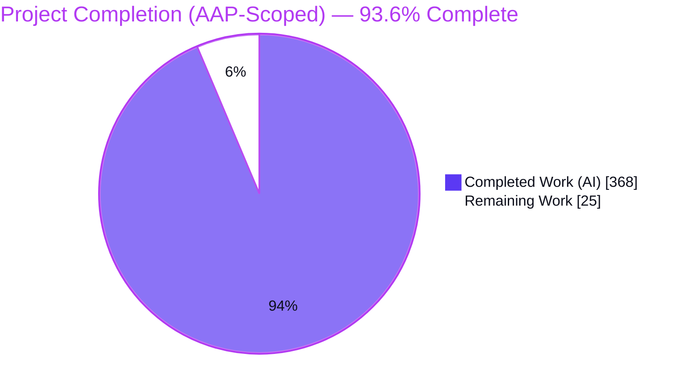
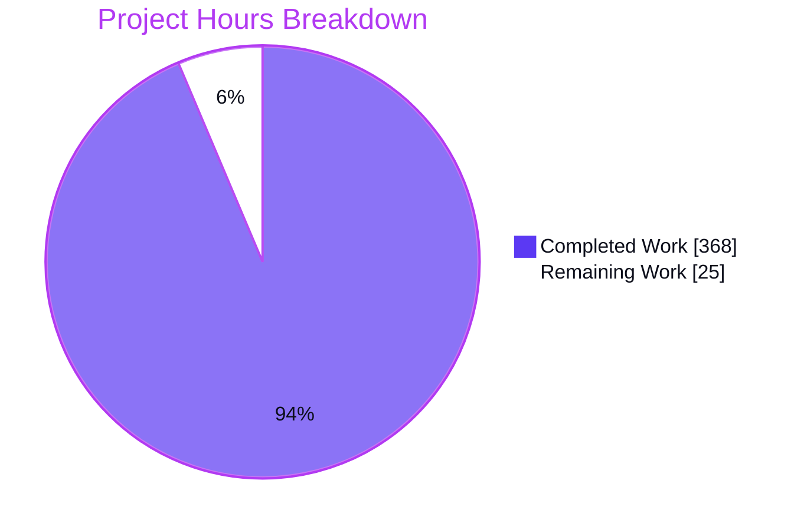
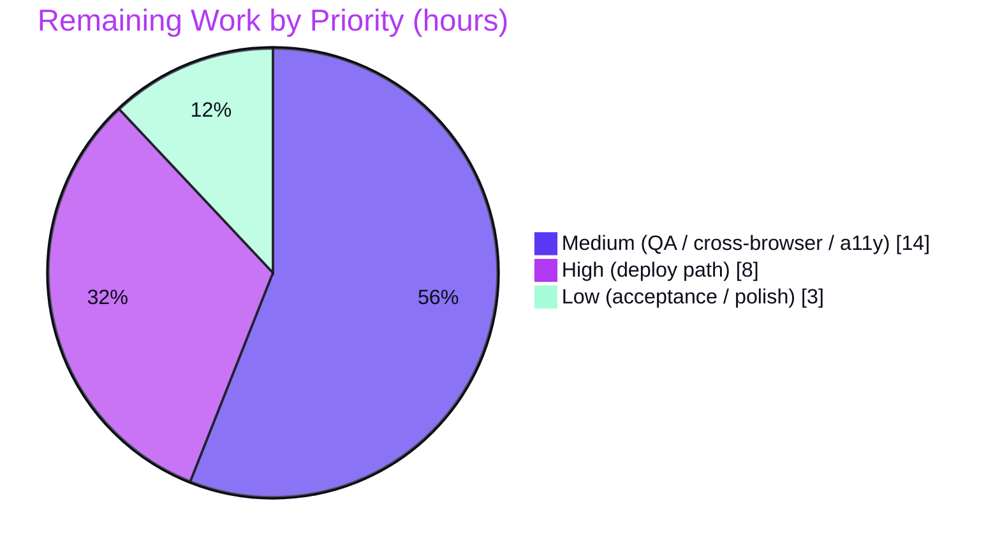

# Blitzy Project Guide — calibre-ui

> **Project:** `calibre-ui` — Standalone UI-only prototype of the Calibre e-book manager
> **Branch:** `blitzy-51dc746b-b60d-43f6-aed1-e8462ab693cd` · **HEAD:** `ae52c2178e`
> **Status:** Production-ready for the AAP UI scope · Pending live deployment & human acceptance

---

## 1. Executive Summary

### 1.1 Project Overview

`calibre-ui` is a standalone, fully-interactive desktop-web UI prototype that reproduces the Calibre e-book manager across seven designed screens in a bespoke dark-navy glassmorphic design system. It is **UI-only**: there is no backend, database, API, or real file/EPUB/conversion logic — every behavior is simulated against an in-memory dataset of exactly 15 science-fiction titles held in React state. Built with Next.js 15 App Router, React 19, TypeScript 5, Tailwind CSS v4 (CSS-first), and Shiki 4, it lives in the `calibre-ui/` subdirectory, leaving the upstream Calibre Python tree untouched as a read-only design reference. Target users are stakeholders and designers validating the redesign before any functional build.

### 1.2 Completion Status



| Metric | Value |
|--------|-------|
| **Total Hours** | **393 h** |
| Completed Hours (AI + Manual) | 368 h (368 AI + 0 Manual) |
| Remaining Hours | 25 h |
| **Percent Complete** | **93.6 %** |

> Completion is measured exclusively against AAP-scoped work plus standard path-to-production activities (PA1 methodology): `368 ÷ (368 + 25) = 93.6 %`. Every AAP code, design, data, and configuration deliverable is complete and independently corroborated; the remaining 25 h is live-deployment execution plus human acceptance, none of which is autonomously completable.

### 1.3 Key Accomplishments

- ✅ **All 5 routes + 2 modals delivered** — `/`, `/grid`, `/viewer`, `/editor`, `/preferences` plus the Convert and Metadata modal overlays (router-free), all reachable via in-app interaction.
- ✅ **78 TypeScript/TSX source files (24,497 LOC)** — net-new, 92 files added, 0 modified, 0 deleted; the Calibre Python tree is 100% untouched.
- ✅ **Bespoke design system** — 16 token-driven primitives + a 492-line CSS-first `@theme` token layer reproducing the exact Figma tokens (`#0C0E1A`, `#181C3C`, `#7B61FF→#A78BFA`, etc.); zero `tailwind.config.js`.
- ✅ **Exact mock data contract** — the `Book` 12-field interface and the precise 15-title catalog (Dune … Use of Weapons).
- ✅ **Full stateful behavior** — List↔Grid view & selection preservation, ≥2-selection batch panel, viewer chapter navigation, editor tab switching with Shiki re-highlight, preferences toggles/sliders — backed by 4 React Context providers.
- ✅ **All build/quality gates green** — `tsc --noEmit` 0 errors, `eslint .` 0 problems, `next build` 8/8 static pages, `npm start` warning-free with PORT binding, 0 dependency vulnerabilities.
- ✅ **Production hardening** — strict CSP and security headers, exact version pinning (Next 15.5.19 per AAP), secret hygiene (`.env.example` names-only).

### 1.4 Critical Unresolved Issues

| Issue | Impact | Owner | ETA |
|-------|--------|-------|-----|
| _None — no code-level blockers remain_ | All AAP build/compile/lint/runtime gates pass; the single validation finding (`output:"standalone"` ⇄ `next start` warning) was already fixed in `ae52c2178e` | — | — |
| Live Railway deployment not yet executed | AAP "publicly reachable URL" gate unmet until a human runs the deploy (see Section 1.6 / human tasks) | DevOps / Maintainer | < 1 day |

> There are **no unresolved code defects**. The only outstanding items are human-only path-to-production activities, tracked in Sections 2.2, 6, and 8.

### 1.5 Access Issues

| System/Resource | Type of Access | Issue Description | Resolution Status | Owner |
|-----------------|----------------|-------------------|-------------------|-------|
| Railway account/project | Deploy platform | A Railway project/service must be created and the repo connected; not available to autonomous agents | Pending — human action | DevOps / Maintainer |
| `RAILWAY_TOKEN` secret | Deploy credential | Token must be provisioned via Railway/CI secure env (never committed); not present in the autonomous environment | Pending — human action | DevOps / Maintainer |
| Railway service **Root Directory** | Platform setting | Must be set to `calibre-ui/` in the Railway dashboard (cannot be set from the repo); without it Nixpacks builds the Python root and fails | Pending — human action | DevOps / Maintainer |

> No source-repository access issues exist — all 92 files are committed and the in-scope working tree is clean. The access items above are inherent to live deployment and require a human with Railway credentials.

### 1.6 Recommended Next Steps

1. **[High]** Create the Railway project/service, connect the branch, and **set the service Root Directory to `calibre-ui/`** (the single most important deploy step).
2. **[High]** Provision `RAILWAY_TOKEN` in Railway/CI secure environment, then trigger the first Nixpacks build & deploy; confirm `next start` binds the injected `PORT`.
3. **[High]** Run production-URL smoke validation on the live deployment (5 routes, both modals, zero console errors, responsive 1440→1280).
4. **[Medium]** Complete human QA/UAT, cross-browser verification (Firefox/Safari/Edge), and an accessibility audit/sign-off.
5. **[Low]** Obtain stakeholder & design acceptance against the Figma reference and apply any minor visual polish.

---

## 2. Project Hours Breakdown

### 2.1 Completed Work Detail

All completed work was delivered autonomously by Blitzy agents and traces to a specific AAP requirement.

| Component | Hours | Description |
|-----------|-------|-------------|
| Project scaffold, build & deploy config | 14 | Pinned `package.json`, strict `tsconfig`, `next.config.ts` (CSP + security headers), CSS-first `postcss`, ESLint flat config, `.gitignore`, `.env.example` |
| Design token system | 16 | `globals.css` `@theme` (492 LOC) + `theme/tokens.ts` mirror (414 LOC); exact Figma token fidelity, zero `tailwind.config.js` |
| Type system & data contract | 6 | `Book` 12-field interface (AAP §0.1.2 verbatim) + `@/types` barrel |
| Mock data modules | 16 | 15-book catalog + viewer chapters + OEBPS editor files + sidebar facets + preferences defaults (1,045 LOC) |
| Rendering library | 12 | Deterministic SVG cover generator, display formatters, cached Shiki v4 singleton (887 LOC) |
| Design-system primitives (16) | 50 | Button, GlassCard, ModalShell, StarRating, TagPill, FormatBadge, Toggle, Select, Tabs, Slider, InputField, ThemeSwatch, CheckBadge, BookCoverPlaceholder, NavRowButton, Textarea (5,726 LOC) |
| State architecture (4 providers) | 28 | Library, Modal, Reader, Preferences Context providers (1,388 LOC) |
| Application shell + navigation wiring | 24 | AppShell, WindowTitleBar, TopToolbar, Sidebar; router pushes + modal triggers (1,111 LOC) |
| App 01 Library List + App 02 Cover Grid | 42 | Table, rows, column header, detail panel, cover grid, cards, batch panel, sort/filter bar, status bar, recently-added (3,152 LOC) |
| App 03 E-book Viewer | 20 | TOC, reading area + progress, toolbar, tools panel, nav strip (1,518 LOC) |
| App 04 EPUB Editor | 22 | Toolbar, file tabs, OEBPS tree, Shiki code view, cream preview (1,507 LOC) |
| App 05 Convert modal | 24 | Dialog, format-select row, option tabs, Look & Feel panel, conversion log (2,177 LOC) |
| App 07 Metadata modal | 26 | Dialog, cover column, field grid, tag-chip editor, identifier rows (2,561 LOC) |
| App 06 Preferences | 18 | Category nav, settings panel, header, behavior grid, theme swatches, margins slider (1,606 LOC) |
| Route pages & provider composition | 10 | 5 route segments + root `layout.tsx` (964 LOC) |
| Responsive integrity pass | 8 | 1440→1280 with zero horizontal overflow across all screens |
| Autonomous review & QA fix cycles | 32 | CP1–CP4 + final + QA rounds: a11y, focus, security headers, perf, token compliance, modal fidelity, the `standalone` fix (~20 fix commits, 223 evidence screenshots) |
| **Total Completed** | **368** | |

### 2.2 Remaining Work Detail

All remaining work is path-to-production execution and human acceptance; none represents an AAP code gap.

| Category | Hours | Priority |
|----------|-------|----------|
| Railway deployment setup (service + **Root Directory = `calibre-ui/`** + Nixpacks build) | 4 | High |
| Secrets provisioning (`RAILWAY_TOKEN` in Railway/CI env) | 1 | High |
| Production URL validation (live smoke: 5 routes + 2 modals, zero console errors, responsive) | 3 | High |
| Human QA / UAT (7 screens, 6 workflows vs Figma sign-off) | 6 | Medium |
| Cross-browser verification (Firefox / Safari / Edge) | 4 | Medium |
| Accessibility audit & sign-off (keyboard, screen reader, dark-theme contrast) | 4 | Medium |
| Stakeholder / design acceptance review & minor polish | 3 | Low |
| **Total Remaining** | **25** | |

### 2.3 Hours Reconciliation & Methodology

| Bucket | Hours |
|--------|-------|
| Completed (Section 2.1) | 368 |
| Remaining (Section 2.2) | 25 |
| **Total Project Hours** | **393** |
| **Percent Complete** | **368 ÷ 393 = 93.6 %** |

Hours are estimated using the PA2 framework, anchored to per-area LOC, component complexity, and the documented review/QA history in git. Confidence is **High** for completed work (independently re-verified: build, type-check, lint, runtime) and **High** for remaining work (a well-understood last-mile of deployment + human verification).

---

## 3. Test Results

Per AAP §0.2.4, **no automated unit-test framework is in scope** — the project's validation gates are runtime/visual. The table below aggregates the gates executed by Blitzy's autonomous validation systems (and independently re-run during this assessment). "Coverage %" denotes gate-pass coverage of the in-scope surface, not code-coverage.

| Test Category | Framework / Tool | Total Checks | Passed | Failed | Coverage % | Notes |
|---------------|------------------|-------------|--------|--------|-----------|-------|
| Static Type-Check | TypeScript 5.9.3 (`tsc --noEmit`, strict) | 78 files | 78 | 0 | 100% | 0 type errors |
| Lint | ESLint 9.39.4 (`next/core-web-vitals` + `next/typescript`) | 82 files | 82 | 0 | 100% | 0 problems |
| Production Build | `next build` 15.5.19 | 8 pages | 8 | 0 | 100% | 8/8 prerendered static, exit 0 |
| Route Runtime Smoke | Headless Chrome + curl | 6 | 6 | 0 | 100% | 5 routes → 200, `/nope` → 404 |
| Stateful Interaction Smoke | Headless Chrome | 12 | 12 | 0 | 100% | nav, both modals, List↔Grid, batch ≥2, viewer nav, editor tabs, prefs |
| Console Error Checks | Chrome DevTools | 12 | 12 | 0 | 100% | zero errors/warnings on load + every nav + modal toggle |
| Responsive Integrity | Headless Chrome (1440 / 1280) | 10 | 10 | 0 | 100% | zero horizontal overflow (5 routes × 2 widths) |
| Dependency Audit | `npm ci` / `npm audit` | 378 pkgs | 378 | 0 | 100% | 0 vulnerabilities |
| **Totals** | | **586** | **586** | **0** | **100%** | Aggregate of all gate units (files, pages, routes, interactions, packages); all green |

> **Integrity note:** Every entry above originates from Blitzy's autonomous validation logs for this project and was re-corroborated on disk during this assessment (`tsc`, `eslint`, `next build`, `next start` + curl). No external or fabricated test sources are included.

---

## 4. Runtime Validation & UI Verification

**Build & server health**
- ✅ **Operational** — `next build` compiles cleanly; 8/8 pages prerendered static.
- ✅ **Operational** — `npm start` (`next start -p ${PORT:-3000}`) starts warning-free, "Ready in ~0.5 s", binds the injected `PORT` (verified on `PORT=4321`).
- ✅ **Operational** — security headers present on every response (CSP, X-Frame-Options: DENY, X-Content-Type-Options: nosniff, Referrer-Policy, Permissions-Policy); `X-Powered-By` removed.

**Routes (5) & modals (2)**
- ✅ **Operational** — `/`, `/grid`, `/viewer`, `/editor`, `/preferences` all render faithfully to Figma and return HTTP 200; unknown paths return 404.
- ✅ **Operational** — Convert (toolbar) and Metadata (detail panel) modals overlay the library without a route change and close via Cancel + Escape.

**Stateful interactions**
- ✅ **Operational** — List↔Grid bidirectional state preservation (view mode + selection).
- ✅ **Operational** — selecting ≥2 grid cards swaps the right panel to `BatchActionsPanel` with computed aggregates (e.g., total size, average rating).
- ✅ **Operational** — viewer chapter navigation; editor tab switching with Shiki re-highlight; preferences toggles + theme swatches.

**Data & assets**
- ✅ **Operational** — exactly 15 books with full metadata; deterministic generated placeholder covers (no real cover art).

**Responsiveness & console**
- ✅ **Operational** — zero horizontal overflow at 1440 px and 1280 px on all routes; zero console errors/warnings across ~12 checks.

**Live production environment**
- ⚠ **Partial** — runtime validated locally and in headless Chrome only; the live Railway URL is **not yet deployed** (pending human action — Sections 1.5 / 2.2).
- ⚠ **Partial** — cross-browser (Firefox/Safari/Edge) rendering of glassmorphism/`backdrop-filter` not yet verified.

---

## 5. Compliance & Quality Review

Cross-mapping of the AAP's explicit rules (§0.9) and quality benchmarks to delivered status.

| Benchmark / AAP Rule | Status | Progress | Notes / Fixes Applied |
|----------------------|--------|----------|-----------------------|
| UI-only, mock-data architecture (no backend/API/DB/file I/O) | ✅ Pass | 100% | No `app/api/**`, no network calls; all state in-memory |
| No Calibre coupling (Python tree reference-only) | ✅ Pass | 100% | 0 files outside `calibre-ui/` touched; no imports from `src/calibre/**` |
| Exact design-token fidelity (zero hardcoded literals) | ✅ Pass | 100% | `@theme` token layer; CP2/CP3 token-compliance findings resolved |
| Compose from primitives (no raw HTML controls) | ✅ Pass | 100% | 16 primitives; R4 primitive-composition findings resolved |
| Generated placeholder covers only (no real art) | ✅ Pass | 100% | `lib/covers.ts` deterministic `data:image/svg+xml` |
| Exact dataset (15 titles, `Book` contract) | ✅ Pass | 100% | Verified verbatim incl. "Use of Weapons" |
| Navigation integrity (all reachable via UI, modals don't route) | ✅ Pass | 100% | Toolbar/sidebar → router/modal; modals router-free |
| State preservation (List↔Grid, batch ≥2) | ✅ Pass | 100% | `LibraryProvider` shared across `/` and `/grid` |
| Version pinning + Next.js 15.x | ✅ Pass | 100% | Exact pins; Next 15.5.19 (deliberate vs npm-current 16.x, documented) |
| Production server binds PORT | ✅ Pass | 100% | `next start -p ${PORT:-3000}`; verified |
| No secrets in source | ✅ Pass | 100% | `.gitignore` `.env*`; `.env.example` names-only; no token committed |
| Responsive + clean console | ✅ Pass | 100% | 1440→1280 no overflow; zero console errors |
| No scope creep | ✅ Pass | 100% | Exactly 5 routes + 2 modals |
| Security headers / hardening | ✅ Pass | 100% | CSP + header baseline added during QA; `unsafe-inline` rationale documented |
| Accessibility (formal audit) | ⚠ In Progress | ~70% | A11y/focus fixes applied autonomously; formal human audit/sign-off pending |
| Live deployment (Railway) | ⚠ In Progress | ~75% | `railway.json` + README + PORT binding authored; live deploy + Root Directory pending |

---

## 6. Risk Assessment

| Risk | Category | Severity | Probability | Mitigation | Status |
|------|----------|----------|-------------|------------|--------|
| Railway **Root Directory** not set to `calibre-ui/` → Nixpacks builds Python root and fails | Operational | High | Medium | README + this guide flag it as the #1 deploy step | Open (human action) |
| `RAILWAY_TOKEN` accidentally committed in future | Security | High | Low | `.gitignore` `.env*`; `.env.example` names-only; recommend pre-commit secret scanning | Mitigated |
| Next.js pinned 15.x reaches EOL (vs npm-current 16.x) | Technical | Low | Medium (over time) | Documented deviation; schedule a 16.x upgrade evaluation post-launch | Accepted / Documented |
| No automated test suite (out of scope) → future regressions uncaught | Technical | Medium | Medium (if extended) | Add Playwright/RTL smoke tests if the prototype graduates to a maintained product | Open by design |
| Production runtime not yet validated on live Railway | Integration | Medium | Low | Production-URL validation task (Section 2.2 item C) | Open (pending deploy) |
| Cross-browser glassmorphism (`backdrop-filter`) rendering differences | Integration | Low-Medium | Medium | Cross-browser verification task (Section 2.2 item E) | Open |
| Dependency CVEs emerge over time (0 today) | Security | Medium | Medium | Pinned lockfile + scheduled review / Dependabot | Mitigated (0 now) |
| CSP `unsafe-inline` weakens XSS defense-in-depth | Security | Low | Low | No user input/backend/eval; static content; optional nonce-based CSP via middleware | Accepted / Documented |
| Mock data resets on reload (no persistence, by design) | Technical | Low | Low | UI-only prototype clearly documented | Mitigated / Documented |
| No app-level monitoring/health endpoint | Operational | Low | Low | Railway platform health + `restartPolicy ON_FAILURE` (10 retries); optional uptime check | Accepted |

> **Overall posture: LOW.** As a UI-only static prototype with no backend/data/integration attack surface, the highest-severity items are operational (deploy Root Directory) and security (token handling) — both well-mitigated by configuration and documentation, requiring human diligence at deploy time.

---

## 7. Visual Project Status

**Project hours — completed vs remaining** (Completed = Dark Blue `#5B39F3`, Remaining = White `#FFFFFF`):



**Remaining 25 h by priority:**



**Remaining hours per category (Section 2.2):**

| Category | Hours | Priority |
|----------|------:|----------|
| Railway deployment setup | 4 | High |
| Secrets provisioning | 1 | High |
| Production URL validation | 3 | High |
| Human QA / UAT | 6 | Medium |
| Cross-browser verification | 4 | Medium |
| Accessibility audit & sign-off | 4 | Medium |
| Stakeholder / design acceptance | 3 | Low |
| **Total** | **25** | |

> **Integrity:** "Remaining Work" = **25 h** in the pie chart equals the Section 1.2 Remaining Hours and the Section 2.2 category total. "Completed Work" = **368 h** equals the Section 1.2 Completed Hours and the Section 2.1 total.

---

## 8. Summary & Recommendations

**Achievements.** The project is **93.6 % complete** on an AAP-scoped basis (368 of 393 hours). Every AAP code, design, data, and configuration deliverable is finished and independently corroborated: all five routes and both modal overlays render faithfully to the Figma reference, the bespoke design-token system and 16 primitives are in place, the exact 15-book dataset and `Book` contract are implemented, and all stateful interactions work. All build/quality gates are green — `tsc` 0 errors, `eslint` 0 problems, `next build` 8/8 static, `npm start` warning-free with correct PORT binding, and 0 dependency vulnerabilities. The single validation finding (the `output:"standalone"` ⇄ `next start` warning) was already fixed.

**Remaining gaps.** The outstanding 25 hours are entirely **path-to-production and human acceptance** — there are no code defects. They comprise the live Railway deployment (8 h, High), human QA/UAT plus cross-browser and accessibility verification (14 h, Medium), and stakeholder/design acceptance (3 h, Low).

**Critical path to production.**
1. Create the Railway service and **set Root Directory = `calibre-ui/`** (the one setting that, if missed, breaks the build).
2. Provision `RAILWAY_TOKEN`, deploy via Nixpacks, and confirm PORT binding on the live URL.
3. Validate the live URL (routes, modals, console, responsive), then run human QA/UAT, cross-browser, and accessibility sign-off.

**Success metrics.** The AAP's success gates — clean build, zero console errors, full metadata for 15 books, view-switching state preservation, batch-panel activation, and responsive integrity 1440→1280 — are **met** in the local/headless environment. The final gate, a **publicly reachable Railway URL**, is the principal remaining milestone.

**Production readiness assessment.** The codebase is **production-ready for its UI-only scope** and safe to deploy. Readiness for stakeholder release is gated only on the live deployment and human acceptance steps above. Recommended posture: proceed to deploy, then complete the verification checklist before broad sign-off.

| Dimension | Assessment |
|-----------|------------|
| Code quality | ✅ Strong — strict TS, fully tokenized, heavily documented |
| Build & CI gates | ✅ All green |
| Security (for UI-only scope) | ✅ Hardened; token handling requires human diligence |
| Deployment | ⚠ Config ready; live deploy pending (human) |
| Acceptance (QA/a11y/cross-browser/stakeholder) | ⚠ Pending (human) |

---

## 9. Development Guide

All commands run from the `calibre-ui/` directory and were verified on this host.

### 9.1 System Prerequisites
- **Node.js ≥ 20** (verified on v20.20.2; Node 22 also supported) — required by Next.js 15, Tailwind v4, Shiki 4.
- **npm ≥ 10** (verified on 11.1.0).
- **git**; a modern browser (Chrome/Firefox/Safari/Edge) to view the app.
- ~500 MB free disk for `node_modules`.

### 9.2 Environment Setup
```bash
# From the repository root, enter the app subdirectory
cd calibre-ui

# No environment variables are required for local development.
# Only if you need to override the port, create .env from the template:
cp .env.example .env      # then set PORT=<port> (and RAILWAY_TOKEN only in CI/Railway, never committed)
```

### 9.3 Dependency Installation
```bash
# Preferred — exact, lockfile-faithful install (CI-grade)
npm ci

# Alternative
npm install
```
Expected: ~378 packages installed, **0 vulnerabilities**.

### 9.4 Application Startup
```bash
# Development (hot reload) — http://localhost:3000
npm run dev

# Production
npm run build        # next build → 8/8 static pages, exit 0
npm start            # next start -p ${PORT:-3000}  (binds injected PORT)
# Example with an explicit port:
PORT=4321 npm start  # → Local: http://localhost:4321 ; "Ready in ~0.5s", warning-free
```

### 9.5 Verification
```bash
# Quality gates
npx tsc --noEmit     # → 0 errors (strict)
npm run lint         # → 0 problems

# Runtime smoke (with the server running on PORT, e.g. 4321)
for r in / /grid /viewer /editor /preferences; do
  curl -s -o /dev/null -w "%{http_code}  $r\n" "http://localhost:4321$r"   # expect 200
done
curl -s -o /dev/null -w "%{http_code}  /nope\n" "http://localhost:4321/nope"  # expect 404

# Security headers (expect CSP, X-Frame-Options, etc.; no X-Powered-By)
curl -sI "http://localhost:4321/" | grep -iE 'content-security-policy|x-frame-options|x-content-type-options'
```

### 9.6 Example Usage
- Open `http://localhost:3000` → **Library List (App 01)** with the 15-book table and detail panel.
- Toolbar **View** → `/grid`; select **≥2** cover cards → the right panel becomes the **Batch Actions** view.
- Detail panel **Read Now** → `/viewer`; use the nav strip / TOC to change chapters.
- Toolbar **Edit Book** → `/editor`; switch file tabs to see Shiki re-highlight; **Prefs** → `/preferences`.
- Toolbar **Convert** → Convert modal; detail panel **Edit Metadata** → Metadata modal (both overlay; close via Cancel/Escape — the route never changes).

### 9.7 Troubleshooting
- **Railway build fails / builds the Python project** → set the service **Root Directory** to `calibre-ui/` in the Railway dashboard.
- **`next start` warns about `standalone`** → already fixed (`output:"standalone"` removed from `next.config.ts`); ensure you are on `ae52c2178e` or later.
- **Port already in use** → set `PORT` to a free port, or stop the process holding it.
- **Stale build artifacts** → `rm -rf .next && npm run build`.
- **Node too old** → upgrade to Node ≥ 20.

---

## 10. Appendices

### Appendix A — Command Reference
| Command | Purpose |
|---------|---------|
| `npm ci` | Exact, lockfile-faithful dependency install |
| `npm run dev` | Start dev server (hot reload) on :3000 |
| `npm run build` | Production build (`next build`) |
| `npm start` | Production server (`next start -p ${PORT:-3000}`) |
| `npm run lint` | ESLint (`eslint .`) |
| `npx tsc --noEmit` | Strict type-check |

### Appendix B — Port Reference
| Port | Service | Notes |
|------|---------|-------|
| 3000 | Next.js dev/prod (default) | Used when `PORT` is unset (`${PORT:-3000}`) |
| `$PORT` | Production (Railway) | Injected by Railway; honored by the start script |

### Appendix C — Key File Locations
| Path | Purpose |
|------|---------|
| `calibre-ui/src/app/` | App Router: `layout.tsx`, `globals.css`, 5 route segments |
| `calibre-ui/src/components/primitives/` | 16 design-system primitives |
| `calibre-ui/src/components/{library,viewer,editor,convert,metadata,preferences,shell}/` | Per-screen + shell components |
| `calibre-ui/src/state/` | `LibraryProvider`, `ModalProvider`, `ReaderProvider`, `PreferencesProvider` |
| `calibre-ui/src/data/` | `books.ts` (15 titles), `chapters.ts`, `editorFiles.ts`, `sidebar.ts`, `preferences.ts` |
| `calibre-ui/src/lib/` | `covers.ts`, `format.ts`, `highlight.ts` (Shiki singleton) |
| `calibre-ui/src/theme/tokens.ts` · `src/types/` | Token mirror · `Book` contract + barrel |
| `calibre-ui/{package.json,tsconfig.json,next.config.ts,postcss.config.mjs,eslint.config.mjs}` | Config/build |
| `calibre-ui/{railway.json,README.md,.env.example}` | Deployment & docs |

### Appendix D — Technology Versions
| Package | Version | Package | Version |
|---------|---------|---------|---------|
| next | 15.5.19 | typescript | 5.9.3 |
| react / react-dom | 19.2.7 | tailwindcss / @tailwindcss/postcss | 4.3.1 |
| shiki | 4.2.0 | postcss | 8.5.15 |
| @types/node | 22.19.21 | eslint | 9.39.4 |
| @types/react | 19.2.17 | eslint-config-next | 15.5.19 |
| @types/react-dom | 19.2.3 | @eslint/eslintrc | 3.3.5 |
| Node.js | ≥ 20 (verified 20.20.2) | npm | ≥ 10 (verified 11.1.0) |

### Appendix E — Environment Variable Reference
| Variable | Required | Where | Purpose |
|----------|----------|-------|---------|
| `PORT` | No (defaults to 3000) | Local `.env` / Railway (injected) | Production server bind port |
| `RAILWAY_TOKEN` | Deploy only | Railway/CI secure env (**never committed**) | Railway deploy credential |

### Appendix F — Developer Tools Guide
- **Type-check:** `npx tsc --noEmit` (strict). **Lint:** `npm run lint` (read-only; do not auto-fix in CI).
- **Build introspection:** `next build` prints the per-route size table (5 routes + `/_not-found`, all `○ Static`).
- **Runtime/console verification:** load each route in the browser and confirm zero console errors; resize 1440→1280 to confirm no horizontal overflow.
- **Security headers:** `curl -sI http://localhost:<PORT>/` to confirm CSP and the hardening header set.

### Appendix G — Glossary
| Term | Meaning |
|------|---------|
| AAP | Agent Action Plan — the authoritative project specification |
| CSS-first (Tailwind v4) | Tokens declared in CSS via `@theme`; no `tailwind.config.js` |
| Primitive | A token-driven reusable design-system component (no raw HTML controls) |
| Batch mode | Grid state when ≥2 books are selected → `BatchActionsPanel` |
| Nixpacks | Railway's auto-detecting build system (detects the Node service) |
| Glassmorphism | The dark-navy translucent card aesthetic of the design system |

---

*Generated by the Blitzy autonomous assessment agent. All metrics independently corroborated on disk (git history, file inventory, `tsc`/`eslint`/`next build`/`next start` re-runs). Completion percentage reflects AAP-scoped work and path-to-production only.*